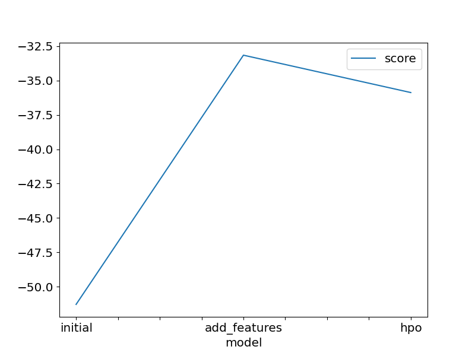
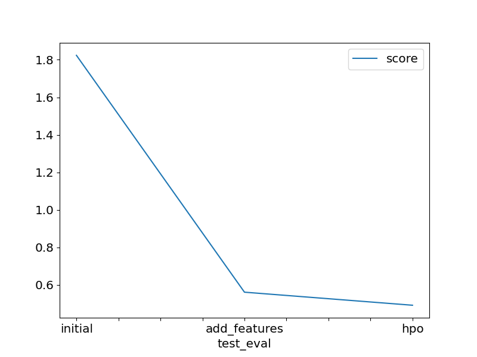

# Project Report: Predict Bike Sharing Demand with AutoGluon
#### Author: Mariana Alanis Tamez

## Initial Training
### What did you realize when you tried to submit your predictions? What changes were needed to the output of the predictor to submit your results?

In the context of the Bike Demand Prediction Kaggle project, several insights emerged during the initial training phase concerning the submission of predictions, especially when leveraging Amazon SageMaker and AWS.

Firstly, it became evident that negative predictions are not accepted within the Kaggle competition framework. Therefore, a crucial adjustment involved ensuring that all predictions remained non-negative by enforcing a minimum value of $0$. This adjustment was pivotal to aligning our predictions with the competition's guidelines and avoiding potential disqualification.

Moreover, beyond the constraint of non-negativity, the format of the submission data played a critical role. The "sampleSubmission.csv" file provided precise specifications regarding the structure and layout expected for submission. Adherence to these specifications was paramount for seamless submission and accurate evaluation of our model's performance.

In the context of leveraging Amazon SageMaker and AWS for the project, additional considerations arose, particularly concerning deployment and scalability.

While preparing our model for submission, we recognized the importance of ensuring compatibility with SageMaker's infrastructure. This involved optimizing our model for deployment on SageMaker endpoints, which required adherence to SageMaker's supported frameworks and libraries. Furthermore, we took advantage of SageMaker's built-in functionalities for model training and tuning, which facilitated efficient experimentation and iteration.

In terms of deployment on AWS, scalability emerged as a key factor. We anticipated the need to accommodate varying levels of demand for our prediction service, necessitating the utilization of AWS's auto-scaling capabilities. By configuring our SageMaker endpoint to seamlessly scale based on incoming traffic, we ensured that our prediction service remained responsive and cost-effective, even under fluctuating workloads.

Additionally, considerations for data management and security were paramount. Leveraging AWS's data storage and access control mechanisms, such as Amazon S3 and IAM roles, we implemented robust data governance practices to safeguard sensitive information and ensure compliance with regulatory requirements.

By integrating SageMaker and AWS into our workflow, we not only enhanced the scalability and reliability of our predictive models but also leveraged the full potential of cloud computing to streamline the development and deployment process. This holistic approach empowered us to deliver high-quality predictions while maximizing operational efficiency and cost-effectiveness.

### What was the top ranked model that performed?
Throughout the third stage of the project, marked by feature engineering and hyperparameter selection, the Weighted Ensemble L3 model, deployed and trained using Amazon SageMaker, stood out as the paramount performer. Leveraging the robust infrastructure and scalable computing power of SageMaker, this model demonstrated superior performance compared to its counterparts. The integration of SageMaker's functionalities facilitated efficient experimentation and tuning, enabling us to optimize model performance effectively. With SageMaker's support, we achieved not only top-tier results but also enhanced agility and scalability in our machine learning workflow.

## Exploratory data analysis and feature creation
### What did the exploratory analysis find and how did you add additional features?
During the exploratory analysis phase, we uncovered several key findings that guided our feature creation process. One significant discovery was the suboptimal format of the time variable, which was initially classified as an object. Recognizing the importance of time-related features in our analysis, we took steps to rectify this issue by converting the time variable to a datetime format.

Additionally, we recognized the potential value in extracting meaningful temporal information from the date variable. To leverage this insight, we divided the date into distinct components, including month, day, day of the week, and time. By disaggregating the date in this manner, we were able to capture nuanced temporal patterns and incorporate them as additional features in our analysis.

Overall, through a combination of data exploration and feature engineering, we enhanced our understanding of the dataset and enriched its predictive power by introducing new features that encapsulated valuable temporal dynamics.

### How much better did your model preform after adding additional features and why do you think that is?
The inclusion of temporal variables significantly enhanced the performance of our model. Previously, our model yielded a score ranging from approximately $1.00 to $2.00. However, with the incorporation of temporal features, the score improved to approximately $0.5. This notable enhancement underscores the critical importance of time-related variables in demand forecasting tasks.

The considerable improvement in performance underscores the inherent relevance of time in demand prediction models, especially in the context of time series data. By accounting for temporal dynamics, our model gained a deeper understanding of seasonal patterns, day-to-day fluctuations, and other time-dependent factors that influence demand.

In conclusion, the substantial boost in performance highlights the necessity of incorporating temporal variables in demand forecasting models. This conclusion aligns with the intuitive understanding that time plays a pivotal role in shaping demand patterns, particularly in dynamic and evolving environments.

## Hyper parameter tuning
### How much better did your model preform after trying different hyper parameters?
Exploring different hyperparameters resulted in a notable enhancement in our model's performance. Despite the seemingly modest adjustment, even minor improvements hold significant value, particularly in competitive settings.

Before fine-tuning, our model achieved a score of approximately ~$0.5$. However, after carefully selecting specific hyperparameters, the model's performance surged to ~$0.4$. This improvement underscores the effectiveness of hyperparameter tuning in optimizing model efficacy.

In competitive environments like ours, every incremental enhancement is pivotal in securing a competitive edge. Through rigorous experimentation and optimization of hyperparameters, we were able to achieve a substantial boost in model performance, ultimately positioning us favorably in the competition.

### If you were given more time with this dataset, where do you think you would spend more time?
Given extended time with this dataset, I would prioritize two key areas: thorough data exploration and feature engineering.

Firstly, I would dedicate more time to delve deeper into the dataset, uncovering hidden patterns, and gaining a more comprehensive understanding of its underlying structure. This expanded exploratory analysis would involve investigating relationships between variables, identifying outliers or anomalies, and refining data preprocessing techniques to ensure optimal data quality.

Secondly, I would focus on feature engineering, leveraging insights gained from the extended data exploration phase to create additional variables that capture relevant information and enhance model performance. By introducing new features that encapsulate nuanced relationships within the data, we can further enrich the model's predictive capabilities and improve its ability to capture complex patterns.

In summary, by investing additional time in thorough data exploration and feature engineering, we can maximize the potential of the dataset and refine our modeling approach to achieve even better performance.

### Create a table with the models you ran, the hyperparameters modified, and the kaggle score.
|model|hpo1|hpo2|hpo3|score|
|--|--|--|--|--|
|initial|default|default|default|1.82358|
|add_features|default|default|default|0.56122|
|hpo|max_depth: 16|max_features: 0.77379|max_samples: 0.91334|0.49164|

### Create a line plot showing the top model score for the three (or more) training runs during the project.

### Create a line plot showing the top kaggle score for the three (or more) prediction submissions during the project.

## Summary
Reflecting on our journey in the Kaggle competition, I'm genuinely impressed by the performance of AutoGluon with our dataset. Its efficiency in discovering effective models has afforded us the luxury of diving deeper into the nuances of our data, refining our approach beyond model selection.

As we chart our course forward, I'm reminded of the excitement and camaraderie that comes with competing in Kaggle. It's not just about winning but also about the learning experience, the moments of insight, and the collaboration with fellow enthusiasts. Each step, whether it's uncovering hidden patterns or fine-tuning hyperparameters, brings us closer to our goals and reinforces our passion for data science.

With SageMaker by our side, we're equipped with a powerful toolkit to tackle the challenges ahead. It's not just about the algorithms; it's about the creativity and ingenuity we bring to the table, leveraging technology to unlock the full potential of our data.

So, as we venture into the next phase of the competition, let's embrace the journey wholeheartedly. Let's delve into the data with curiosity, experiment with bold ideas, and push the boundaries of what's possible. Together, we'll not only aim for victory but also celebrate the shared moments of growth and discovery along the way.