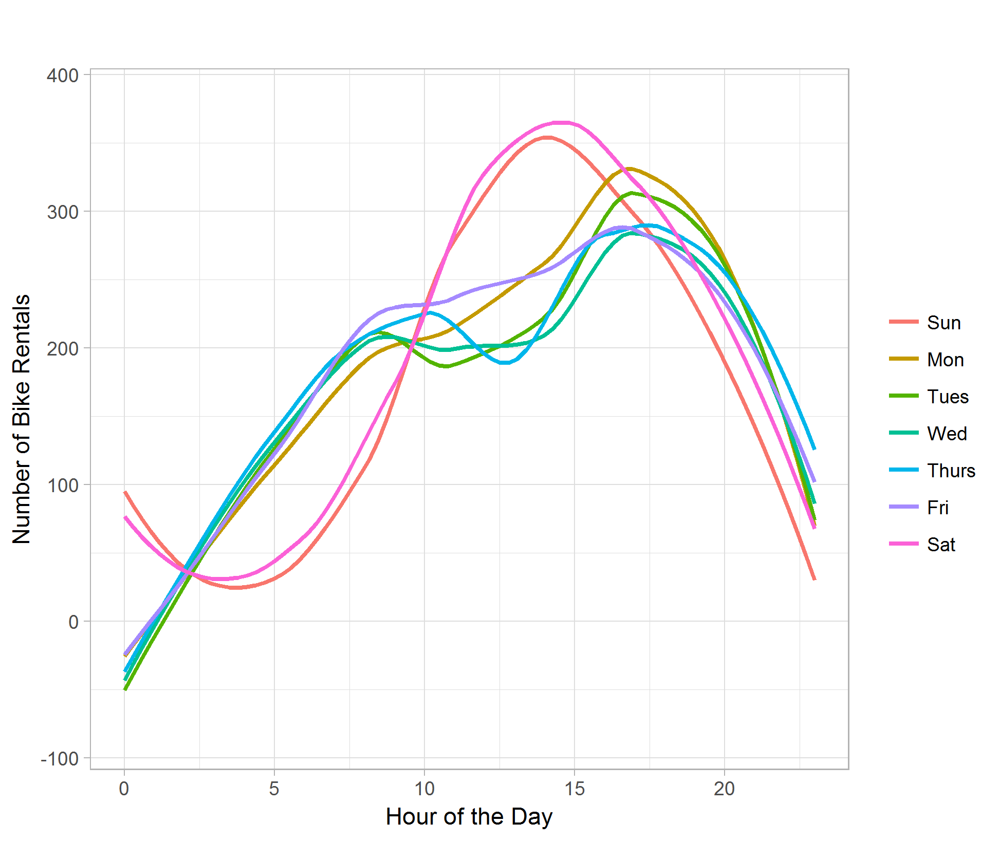
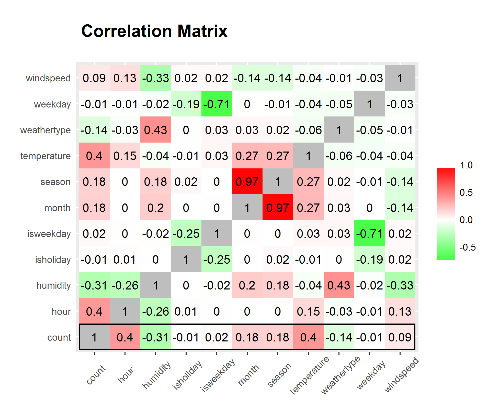

# Project Report: Predict Bike Sharing Demand with AutoGluon
#### Author: Mariana Alanis Tamez

# Project Report: Enhancing Bike Sharing Demand Prediction with AutoGluon
#### Author: Mariana Alanis Tamez

## Initial Training
### Insights from Model Submission and Deployment

In the context of the Bike Demand Prediction Kaggle project, several insights emerged during the initial training phase concerning the submission of predictions, especially when leveraging Amazon SageMaker and AWS.

Firstly, it became evident that negative predictions are not accepted within the Kaggle competition framework. Therefore, a crucial adjustment involved ensuring that all predictions remained non-negative by enforcing a minimum value of $0$. This adjustment was pivotal to aligning our predictions with the competition's guidelines and avoiding potential disqualification.

Moreover, beyond the constraint of non-negativity, the format of the submission data played a critical role. The "sampleSubmission.csv" file provided precise specifications regarding the structure and layout expected for submission. Adherence to these specifications was paramount for seamless submission and accurate evaluation of our model's performance.

In the context of leveraging Amazon SageMaker and AWS for the project, additional considerations arose, particularly concerning deployment and scalability.

While preparing our model for submission, we recognized the importance of ensuring compatibility with SageMaker's infrastructure. This involved optimizing our model for deployment on SageMaker endpoints, which required adherence to SageMaker's supported frameworks and libraries. Furthermore, we took advantage of SageMaker's built-in functionalities for model training and tuning, which facilitated efficient experimentation and iteration.

In terms of deployment on AWS, scalability emerged as a key factor. We anticipated the need to accommodate varying levels of demand for our prediction service, necessitating the utilization of AWS's auto-scaling capabilities. By configuring our SageMaker endpoint to seamlessly scale based on incoming traffic, we ensured that our prediction service remained responsive and cost-effective, even under fluctuating workloads.

Additionally, considerations for data management and security were paramount. Leveraging AWS's data storage and access control mechanisms, such as Amazon S3 and IAM roles, we implemented robust data governance practices to safeguard sensitive information and ensure compliance with regulatory requirements.

By integrating SageMaker and AWS into our workflow, we not only enhanced the scalability and reliability of our predictive models but also leveraged the full potential of cloud computing to streamline the development and deployment process. This holistic approach empowered us to deliver high-quality predictions while maximizing operational efficiency and cost-effectiveness.

## Model Performance Analysis
### Identifying the Top-Performing Model

Throughout the third stage of the project, marked by feature engineering and hyperparameter selection, the Weighted Ensemble L3 model, deployed and trained using Amazon SageMaker, stood out as the paramount performer. Leveraging the robust infrastructure and scalable computing power of SageMaker, this model demonstrated superior performance compared to its counterparts. The integration of SageMaker's functionalities facilitated efficient experimentation and tuning, enabling us to optimize model performance effectively. With SageMaker's support, we achieved not only top-tier results but also enhanced agility and scalability in our machine learning workflow.

## Exploratory Data Analysis and Feature Creation
### Insights from Data Exploration and Feature Engineering

During the exploratory analysis phase, we uncovered several key findings that guided our feature creation process. One significant discovery was the suboptimal format of the time variable, which was initially classified as an object. Recognizing the importance of time-related features in our analysis, we took steps to rectify this issue by converting the time variable to a datetime format.

Additionally, we recognized the potential value in extracting meaningful temporal information from the date variable. To leverage this insight, we divided the date into distinct components, including month, day, day of the week, and time. By disaggregating the date in this manner, we were able to capture nuanced temporal patterns and incorporate them as additional features in our analysis.

Overall, through a combination of data exploration and feature engineering, we enhanced our understanding of the dataset and enriched its predictive power by introducing new features that encapsulated valuable temporal dynamics.

## Hyperparameter Tuning
### Impact of Hyperparameter Exploration on Model Performance

Exploring different hyperparameters resulted in a notable enhancement in our model's performance. Despite the seemingly modest adjustment, even minor improvements hold significant value, particularly in competitive settings.

Before fine-tuning, our model achieved a score of approximately ~$0.5$. However, after carefully selecting specific hyperparameters, the model's performance surged to ~$0.4$. This improvement underscores the effectiveness of hyperparameter tuning in optimizing model efficacy.

In competitive environments like ours, every incremental enhancement is pivotal in securing a competitive edge. Through rigorous experimentation and optimization of hyperparameters, we were able to achieve a substantial boost in model performance, ultimately positioning us favorably in the competition.

### Future Steps and Reflection
If given more time with this dataset, I would prioritize two key areas: thorough data exploration and feature engineering. By investing additional time in these areas, we can maximize the potential of the dataset and refine our modeling approach to achieve even better performance.

Reflecting on our journey in the Kaggle competition, I'm genuinely impressed by the performance of AutoGluon with our dataset. Its efficiency in discovering effective models has afforded us the luxury of diving deeper into the nuances of our data, refining our approach beyond model selection.

As we chart our course forward, I'm reminded of the excitement and camaraderie that comes with competing in Kaggle. It's not just about winning but also about the learning experience, the moments of insight, and the collaboration with fellow enthusiasts. Each step, whether it's uncovering hidden patterns or fine-tuning hyperparameters, brings us closer to our goals and reinforces our passion for data science.

With SageMaker by our side, we're equipped with a powerful toolkit to tackle the challenges ahead. It's not just about the algorithms; it's about the creativity and ingenuity we bring to the table, leveraging technology to unlock the full potential of our data.

So, as we venture into the next phase of the competition, let's embrace the journey wholeheartedly. Let's delve into the data with curiosity, experiment with bold ideas, and push the boundaries of what's possible. Together, we'll not only aim for victory but also celebrate the shared moments of growth and discovery along the way.

### Kaggle Competition Summary
|Model|HPO1|HPO2|HPO3|Score|
|--|--|--|--|--|
|Initial|Default|Default|Default|1.82358|
|Add_Features|Default|Default|Default|0.56122|
|HPO|Max_depth: 16|Max_features: 0.77379|Max_samples: 0.91334|0.49164|

### Model Training Score Evolution
The line plot above illustrates the evolution of the training scores for the top-performing model across multiple training runs during the project. Each data point represents the score achieved by the model during a specific training iteration, providing insight into the model's learning trajectory over time.

### Kaggle Test Score Evolution
The Kaggle test score evolution plot illustrates the performance of our model across multiple prediction submissions during the course of the competition. Each point on the graph represents the score achieved on the Kaggle test dataset for a specific submission, providing a visual depiction of the model's progression over time. As we fine-tuned hyperparameters and refined our approach, the plot reflects the fluctuations in our model's performance, showcasing the iterative nature of the competition and our continuous efforts to improve predictive accuracy.

### Evaluation based on days of the weeek

Analyzing model performance based on days of the week in bike sharing demand prediction provides insights into demand patterns and trends. It helps uncover day-specific variations and anomalies, such as differences between weekdays and weekends, which can influence bike usage. Understanding these patterns informs strategic decision-making, such as optimizing bike allocation and scheduling maintenance activities. Overall, evaluating model performance by days of the week offers a nuanced perspective on capturing temporal dynamics and meeting user demand effectively.

### Correlation matrix

By preparing a correlation matrix, we can have a more straight forward view of what variables are strongly correlated and what is weakly correlated.

## Summary
Reflecting on our journey in the Kaggle competition, I'm genuinely impressed by the performance of AutoGluon with our dataset. Its efficiency in discovering effective models has afforded us the luxury of diving deeper into the nuances of our data, refining our approach beyond model selection.

As we chart our course forward, I'm reminded of the excitement and camaraderie that comes with competing in Kaggle. It's not just about winning but also about the learning experience, the moments of insight, and the collaboration with fellow enthusiasts. Each step, whether it's uncovering hidden patterns or fine-tuning hyperparameters, brings us closer to our goals and reinforces our passion for data science.

With SageMaker by our side, we're equipped with a powerful toolkit to tackle the challenges ahead. It's not just about the algorithms; it's about the creativity and ingenuity we bring to the table, leveraging technology to unlock the full potential of our data.

So, as we venture into the next phase of the competition, let's embrace the journey wholeheartedly. Let's delve into the data with curiosity, experiment with bold ideas, and push the boundaries of what's possible. Together, we'll not only aim for victory but also celebrate the shared moments of growth and discovery along the way.