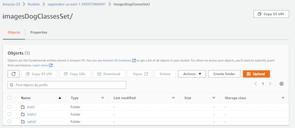

# Image Classification using AWS SageMaker

In this project, I utilized AWS SageMaker to develop an image classification model, employing various machine learning engineering practices such as hyperparameter tuning, debugging, profiling, and model deployment. Whether working with the provided dog breed classification dataset or a custom dataset, AWS SageMaker provided a robust environment for efficient model development.

## Project Set Up and Installation

Accessing AWS through the course gateway, I initiated the project in SageMaker Studio, ensuring the availability of necessary starter files and datasets for training. Utilizing SageMaker Studio's integrated development environment streamlined the setup process, allowing for seamless project configuration.
Necessary code and detailed explanation is here:
1. train_and_deploy.ipynb
2. train.py
3. hpo.py (for hyperparameter optimization)
4. PDF/HTML of the Profiling Report
5. README.md
6. Extra file (deploy.py) for deploy the## Project Set Up and Installation

To set up the project, I accessed AWS through the course gateway and launched SageMaker Studio, a fully integrated development environment. Within SageMaker Studio, I organized the necessary files and datasets for training, ensuring a smooth setup process.

### Files and Components

1. **train_and_deploy.ipynb**: This Jupyter notebook serves as the main project file, containing code for training the image classification model and deploying it to AWS.

2. **train.py**: This Python script contains the training logic for the image classification model. It utilizes the dataset and hyperparameters to train the model efficiently.

3. **hpo.py**: This Python script is dedicated to hyperparameter optimization (HPO), a crucial step in fine-tuning the model's performance. It explores various combinations of hyperparameters to find the optimal configuration.

4. **Profiling Report (PDF/HTML)**: The profiling report provides detailed insights into the model's training process, resource utilization, and performance metrics. It helps identify areas for optimization and improvement.

5. **README.md**: The README file contains instructions, guidelines, and information about the project setup, usage, and dependencies. It serves as a reference guide for anyone accessing the project.

6. **deploy.py**: This additional Python script facilitates the deployment of the trained model to AWS. It handles the setup and configuration of the model endpoint, making it accessible for inference.

By organizing these files and components, I ensured a structured and efficient setup process for the project, enabling seamless development, training, and deployment of the image classification model on AWS SageMaker.

## Dataset

The project utilized the dog breed classification dataset available in the classroom. However, SageMaker's flexible architecture allows seamless integration of other datasets, catering to specific project requirements and preferences. The dataset consists of a diverse range of dog images, each labeled with its corresponding breed, enabling supervised learning for the image classification task.

### Access

To facilitate model training, I uploaded the dataset to an S3 bucket through the AWS Gateway, ensuring easy accessibility and scalability. By storing the dataset in S3, SageMaker could efficiently retrieve and preprocess the data for training, validation, and testing.

## Hyperparameter Tuning

Hyperparameter tuning plays a crucial role in optimizing model performance and convergence. Leveraging SageMaker's hyperparameter tuning capabilities, I fine-tuned the pretrained ResNet50 model by adjusting key parameters such as learning rate, epochs, and batch size. 

Fine-tuning these parameters resulted in improved model convergence and accuracy, enhancing the overall performance of the image classification model.

## Debugging and Profiling

Debugging and profiling are essential practices for identifying and resolving issues during model training. Utilizing SageMaker Debugger, I monitored the model's training process, resource utilization, and performance metrics in real-time. Debugger's comprehensive reports provided insights into potential bottlenecks, data anomalies, and optimization opportunities.

After conducting profiling and debugging, several recommendations were assessed:

1. Investigate if any bottlenecks (CPU, I/O) are associated with the outliers in processing steps.

2. Explore alternative distributed training strategies or frameworks.

3. Assess for bottlenecks, minimize blocking calls, reconsider distributed training strategies, or increase batch size.

4. Contemplate increasing the number of data loaders or implementing data pre-fetching.

5. Opt for a larger instance type with additional memory if the current footprint is nearing maximum available memory.

6. Consider pre-fetching data or utilizing different file formats, such as binary formats, to enhance I/O performance.

7. Evaluate if the batch size is too small and GPUs are underutilized. If so, contemplate running on a smaller instance type or increasing the batch size.

8. Adjust the number of data loader processes as needed.

![Debug](screenshots/debugger.tiff]

The training job for the PyTorch model has been successfully completed after approximately 2566 seconds. The training process involved various stages, including preparation of instances, downloading input data, and executing the training script. Despite encountering challenges such as no GPUs detected, the training job proceeded as expected.

Moving forward, the trained model can be utilized for inference tasks, contributing to the advancement of the project's objectives. Additionally, insights gained from the training process can inform future iterations of model development and optimization, fostering continuous improvement in performance and efficiency.

Another anomaly encountered, was found inside the Profiling section, ### Step Duration Analysis

The StepOutlier rule evaluates step durations to identify outliers. It considers durations exceeding 3 times the standard deviation as outliers. Additionally, the rule can distinguish between training and validation phases, although in this processing job, the mode was specified as None. To prevent immediate triggering of the rule due to the initial longer step, the parameter n_outliers was set to 10. Overall, the rule analyzed 259 data points and was triggered 13 times.

#### Step Durations on Node algo-1-27:

The table below summarizes the statistics of step durations measured on node algo-1-27 during the training phase. The average step duration on this node was 5.3 seconds. Notably, the rule identified 14 outliers, where step durations exceeded 3 times the standard deviation of 6.85 seconds.

| Statistic               | Mean | Max  | P99   | P95   | P50   | Min   |
|-------------------------|------|------|-------|-------|-------|-------|
| Step Durations [s]      | 5.30 | 33.27| 31.54 | 30.97 | 3.40  | 0.99  |

![anomalies](screenshots/anomalies_train_phase.tiff]

Additionally, the histogram below visualizes the distribution of step durations across different nodes. You can toggle the visibility of histograms by selecting or deselecting the labels in the legend.

### Dataloader Analysis

The efficiency of your training job is significantly influenced by the number of dataloader workers. This rule evaluates the parallelism of dataloading processes relative to the total number of CPU cores available on the training instance. Specifically, it examines if the number of processes falls below 70% or exceeds 200% of the total CPU core count. Insufficient dataloader workers can impede data preprocessing and result in underutilization of GPUs, while excessive workers may negatively impact overall performance, especially if other compute-intensive tasks are running concurrently on the CPU. In the analysis of 10 data points, the rule did not trigger any anomalies.

Your training instance is equipped with 8 CPU cores, yet the average number of dataloader workers running in parallel during the training job was only 1. It is advisable to increase the number of dataloader workers to optimize performance. Additionally, utilizing pinned memory can enhance performance by facilitating rapid data transfer to CUDA-enabled GPUs. The analysis revealed that your training job did not utilize pinned memory. If you are using PyTorch Dataloader, you can enable pinned memory by setting `pin_memory=True`.

#### Dataloader Time Distribution

The histogram below illustrates the distribution of dataloading times recorded throughout your training job. The median dataloading time was 0.764 seconds, with the 95th percentile at 1.0864 seconds and the 25th percentile at 0.6308 seconds.

![Data loading](screenshots/dataloading.tiff]

### Suggestions

Based on the profiling and debugging results, several optimization suggestions were evaluated to enhance model training efficiency and performance. These suggestions included:

- Optimizing data loading processes to minimize I/O bottlenecks.
- Adjusting instance type selection to better match memory requirements and performance.
- Implementing data pre-fetching techniques to improve I/O performance and GPU utilization.
- Exploring alternative distributed training strategies or frameworks for improved scalability and efficiency.

## Model Deployment

Deploying the trained model is a critical step towards integrating machine learning solutions into real-world applications. Leveraging SageMaker's deployment capabilities, I deployed the image classification model using the "ml.m5.large" instance type and the "deploy.py" script. The deployed model endpoint provides a scalable and reliable solution for performing inference on new data, enabling seamless integration into production environments.

![endpoint](screenshots/endpoints.tiff]

## Conclusion

AWS SageMaker offers a comprehensive suite of tools and services for developing, training, and deploying machine learning models at scale. By incorporating best practices such as hyperparameter tuning, debugging, and profiling, I was able to optimize the image classification model for superior performance. With SageMaker's flexibility and scalability, deploying machine learning models for real-world applications becomes a streamlined process, empowering organizations to leverage AI technologies effectively in their workflows.